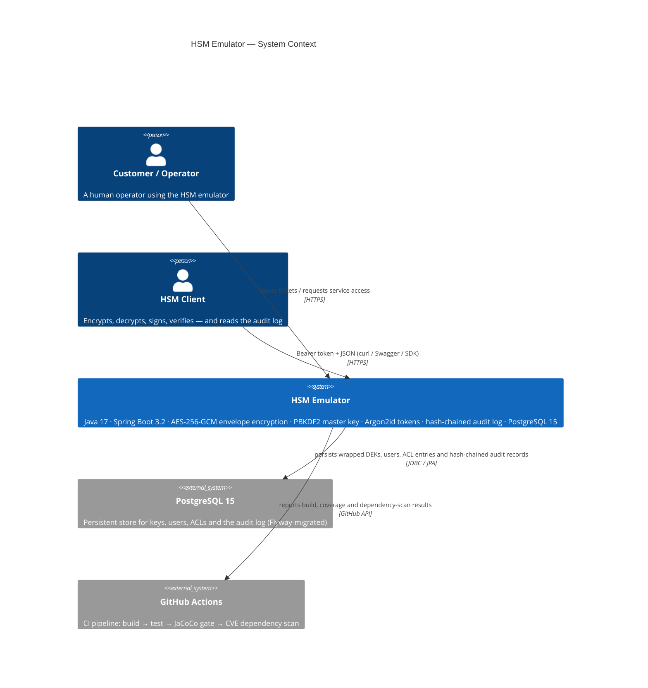

# 🔐 HSM Emulator

**A production-pattern software emulation of a Hardware Security Module (HSM)**

> *Built with Java 17 · Spring Boot 3 · AES-256-GCM · PBKDF2 · Argon2id · PostgreSQL*


](https://adoptium.net/)
[](https://spring.io/projects/spring-boot)
[](https://hub.docker.com/_/postgres)
[](https://github.com/hulamanisrinish-cpu/HSM-Emulator/actions)
[](LICENSE)

---

## 📌 Overview

> Hardware Security Modules are the gold standard for protecting cryptographic keys.
> Banks, certificate authorities, and payment networks rely on them — dedicated
> physical devices where keys are generated, stored, and used *without ever leaving
> the hardware boundary*.

This project reproduces those security abstractions **entirely in software**, using
the same design patterns found in real HSMs — but **educational, not FIPS-certified**.
It demonstrates secure-by-design engineering: envelope encryption, separation of
duties, and tamper-evident logging using only standard, audited Java cryptographic
primitives.

### What it does

| Capability | Mechanism |
|------------|-----------|
| **Envelope encryption** | Every key is AES-256-GCM wrapped with a PBKDF2-derived master key; raw key bytes never touch the database |
| **Four-role RBAC** | Admin · CryptoOfficer · AppClient · Auditor, with per-key ACLs |
| **Hash-chained audit log** | SHA-256 chain; `GET /audit/verify` detects any insertion, deletion, or tamper |
| **Authenticated cryptography** | AES-256-GCM, SHA256withRSA, SHA256withECDSA |
| **Token auth with oracle** | Argon2id token hashing; 401 identical for bad/unknown token |

> ⚠️ **Educational project.** See [Known Limitations](#-known-limitations) before drawing
> conclusions about certified key protection.

---

## 🎯 Problem

Keys must be generated, stored, and used **without ever leaving a trusted boundary**.
A real HSM provides:

- **Tamper-resistant key storage** (hardware-backed)
- **Non-repudiable audit logging** (signed, hash-chained)
- **Separation of duties** between operators
- **Authenticated encryption + digital signatures** as a single atomic operation

Replicating these properties in **software** — with no hardware — is a hard
engineering problem. This project is a transparent, educational implementation of
those patterns.

## 💡 Solution

HSM Emulator implements the security architecture of a hardware HSM in a single
Spring Boot 3.2 process:

- **Envelope encryption** — every Data Encryption Key (DEK) is AES-256-GCM wrapped;
  the master key is PBKDF2-derived, lives in JVM heap, and is never persisted
- **Separation of duties** — four roles enforce different capabilities; AppClients
  receive keys only via explicit ACL grants
- **Tamper-evident audit log** — SHA-256 hash chain with an integrity-verify endpoint
- **Hot-swappable key management** — keys can be disabled, rotated (versioned), and
  destroyed irreversibly

---

## ✨ Features

| Feature | Detail |
|---------|--------|
| **Envelope encryption** | AES-256-GCM wrapping of every DEK; master key PBKDF2-derived, in-process only |
| **Four-role RBAC** | Admin / CryptoOfficer / AppClient / Auditor with per-key ACLs |
| **Hash-chained audit log** | `chainHash = SHA256(prev‖seq‖ts‖principal‖action‖outcome)`; tamper-verifiable |
| **Key lifecycle** | Create, disable, enable, rotate (versioned name), destroy (irreversible) |
| **Crypto operations** | encrypt / decrypt (envelope) · sign / verify (RSA-2048 / EC P-256) |
| **AppClient ACLs** | Granular per-key permissions; enforced in `CryptoService` before any unwrap |
| **Authentication oracle** | 401 is identical for bad/unknown/expired tokens — no oracle leakage |
| **No custom cryptography** | 100% `javax.crypto` (JCA); Bouncy Castle confined to `TokenService` for Argon2id |
| **Master key never persisted** | In-memory only; zeroed on shutdown |
| **Fresh IV every encrypt** | `SecureRandom` IV per call; no counter needed |

---

## 🏗️ Architecture

Four operator roles reach a single Spring Boot 3.2 process behind an HTTPS
terminator. Business logic lives in services that orchestrate a stateless
`CryptoEngine`, an in-memory master-key service, and a hash-chained audit service —
all backed by PostgreSQL 15.

### System context (C4)



### Container diagram (deployment units + runtime components)

```mermaid
C4Container
    title HSM Emulator — Container Diagram

    Person(customer, "Customer (operator)", "Admin · CryptoOfficer · AppClient · Auditor")
    Person(app, "HSM Client", "cURL / Swagger UI / SDK")

    System_Boundary(hsm, "HSM Emulator") {
        System(app, "Spring Boot 3.2 App", "Java 17",
            "REST controllers, @PreAuthorize RBAC, Argon2id auth, envelope-encryption crypto services, hash-chained audit service, Flyway migrations")
        System_Ext(db, "PostgreSQL 15", "PostgreSQL",
            "hsm_keys (wrapped DEK, IV, auth tag) · hsm_users (Argon2id hash) · hsm_key_acls · hsm_audit_log (hash chain) · hsm_config")
        System_Ext(lb, "HTTPS Terminator", "nginx / Traefik",
            "Terminates TLS, forwards to :8080, rate-limits, rejects malformed requests at the edge")
    }

    Rel(customer, app, "HTTPS + Bearer token", "curl / Swagger UI / SDK")
    Rel(app, db, "JDBC / Spring Data JPA + Flyway", "Docker network")
    Rel(lb, app, "HTTP/1.1 → :8080", "Docker network")
```

### ASCII architecture (plain Markdown fallback)

```text
  Client Layer (Admin · CryptoOfficer · AppClient · Auditor)
                     │  Bearer Token + JSON
                     ▼
  ┌──────────────────────────────────────────────────────────────┐
  │              🔒 SECURITY BOUNDARY (Docker network)              │
  │                                                              │
  │   ┌─────────────────────┐        ┌─────────────────────┐     │
  │   │ HTTPS Terminator    │  HTTP  │  Spring Boot 3.2    │     │
  │   │ (nginx / Traefik)   │───────▶│  Application (JVM)  │     │
  │   └─────────────────────┘        └─────────────────────┘     │
  │           │  TLS                         │  JDBC / JPA       │
  │           ▼                              ▼                   │
  │   ┌─────────────────────┐        ┌─────────────────────┐     │
  │   │ PostgreSQL 15       │ ◀───────│  Flyway + JPA     │     │
  │   │ hsm_keys · hsm_users│        │  hsm_key_acls     │     │
  │   │ hsm_audit_log       │        │  hsm_config       │     │
  │   └─────────────────────┘        └─────────────────────┘     │
  │                                                              │
  │   Security filters (TokenAuthenticationFilter):              │
  │   • 401 oracle for bad/unknown token                         │
  │   • Argon2id authentication                                │
  └──────────────────────────────────────────────────────────────┘


  App-internal layer breakdown (Spring Boot 3.2 JVM)
  ──────────────────────────────────────────────────────────────

  [ Edge ]    SecurityConfig (filter chain) · TokenAuthenticationFilter · HsmPrincipal
  [ API ]     UserController · KeyController · CryptoController · AuditController
  [ Service ] UserService · KeyService · CryptoService · AuditService
  [ Crypto ]  CryptoEngine (JCA: AES-256-GCM · RSA-2048 · EC P-256) · MasterKeyService (PBKDF2)
  [ Audit ]   AuditService (SHA-256 hash-chained log, REQUIRES_NEW for DENIED/ERROR)
  [ Persistence ] Spring Data JPA · Flyway migrations · PostgreSQL 15

  Key security controls in the container boundary:
  • Envelope encryption — every DEK is AES-256-GCM wrapped with a PBKDF2-derived master key;
    the master key never leaves the JVM heap and is never persisted.
  • Authentication oracle — the 401 response is identical for unknown user, expired token,
    and malformed token (no oracle leakage).
  • Token storage — only the Argon2id hash is written to PostgreSQL; raw tokens are never
    stored (Testcontainers + docker-compose verified at runtime).
  • Hash-chained audit log — each record commits to the previous hash; tamper is detectable
    via GET /audit/verify, which returns { valid: true|false, firstTamperedSequence }.
```

### Key security properties visible across the stack

| Property | Where it is enforced | Mechanism |
|----------|---------------------|-----------|
| **Envelope encryption** | `CryptoEngine` + `MasterKeyService` | AES-256-GCM wrapping of every DEK; master key PBKDF2-derived from the passphrase, in-process only, never persisted |
| **Authentication oracle** | `TokenAuthenticationFilter` | 401 identical for unknown user, expired token, and malformed token — no oracle leakage |
| **Token storage** | `hsm_users` + `TokenService` | Argon2id hash (BC); only the hash is written to PostgreSQL |
| **Key material at rest** | `hsm_keys` | Raw key bytes never written; stored as `IV + wrapped DEK + auth tag` only |
| **In-memory master key** | `MasterKeyService` | Derived once per startup from `HSM_MASTER_PASSPHRASE`; zeroed on shutdown |
| **Plaintext never in logs/DTOs** | `HsmUser.toString()` / `HsmKey.toString()` / controllers | Secret fields excluded; `SecureArrays#fill` zeroes ephemeral key material after use |
| **Hash-chained audit log** | `AuditService` | `chainHash(N) = SHA256(prev ‖ seq ‖ ts ‖ principal ‖ action ‖ outcome)`; tamper-evident, append-only, single-writer |
| **Separation of duties** | `@PreAuthorize` + ACLs | Admin ≫ `CryptoOfficer ≫ AppClient ≫ Auditor` boundary; per-key ACL enforced in `CryptoService` before any unwrap |
| **No custom cryptography** | `CryptoEngine` (JCA only) | 100% `javax.crypto` / `java.security`; Bouncy Castle confined to `Argon2TokenHashingService` |

### Component responsibilities (inside the Spring Boot 3.2 JVM)

| Layer | Responsibility | Key classes |
|-------|----------------|-------------|
| **Edge / security** | Token extraction, Argon2id authentication, 401-oracle, request/response logging | `SecurityConfig`, `TokenAuthenticationFilter`, `HsmPrincipal` |
| **REST controllers** | HTTP mapping, `@Valid` input validation, DTO serialisation, exception → status mapping | `UserController`, `KeyController`, `CryptoController`, `AuditController` |
| **Service layer** | Business logic + RBAC (secondary `@PreAuthorize` check) + per-key ACL enforcement + orchestration + audit append | `UserService`, `KeyService`, `CryptoService`, `AuditService` |
| **Crypto engine** | Stateless JCA wrapper; never returns raw key bytes up the stack | `CryptoEngine`, `MasterKeyService`, `CryptoEngine*` helpers |
| **Persistence** | Spring Data JPA + Flyway migrations; no raw key material in entities | `HsmUser`, `HsmKey`, `HsmKeyAcl`, `AuditRecord`, `HsmConfig` |
| **Observability** | Structured log markers, metrics hooks, audit-read endpoint, chain-verification endpoint | `AuditController`, `GlobalExceptionHandler`, JaCoCo reports |

---

## 🛠️ Tech Stack

| Layer | Choice | Justification |
|-------|--------|---------------|
| **Language** | Java 17 (LTS) | Long-term support until 2029. Strong static typing aids security review. `java.security` and `javax.crypto` APIs are the JCA standard — no third-party risk for core crypto. |
| **Framework** | Spring Boot 3.x | Industry-standard; Spring Security provides battle-tested authentication/authorization hooks. Spring Data JPA removes boilerplate DB code while keeping testability. |
| **Build tool** | Maven 3.9 | Ubiquitous in Java enterprise; straightforward plugin ecosystem (Surefire, JaCoCo, OWASP Dependency-Check). Reproducible builds with `<dependencyManagement>`. |
| **Core crypto** | JCA (`javax.crypto`) | Standard library; no additional attack surface. AES-256-GCM, PBKDF2-HmacSHA256, RSA-2048, EC P-256, SHA-256 are all available without third-party jars. Never custom cryptography. |
| **Token hashing** | Bouncy Castle (`bcprov-jdk18on`) | JCA does not expose Argon2id. Bouncy Castle is the de-facto standard Java security library (used by many JDK vendors internally). Confined to `TokenService` only. |
| **Database** | PostgreSQL 15 | ACID guarantees for key records and audit log. Partial-index and sequence support. Avoids in-memory H2 whose semantics differ from production Postgres. |
| **ORM** | Spring Data JPA / Hibernate 6 | Standard persistence layer; query methods are explicit and reviewable. Named JPQL queries prevent SQL injection. |
| **Auth integration** | Spring Security 6 | `OncePerRequestFilter` for token extraction; `AuthenticationProvider` for token resolution. Well-audited; avoids hand-rolled auth middleware. |
| **API docs** | Springdoc OpenAPI 2 (`springdoc-openapi-starter-webmvc-ui`) | Generates OpenAPI 3.0 spec and Swagger UI automatically from annotations. Zero config for basic use. |
| **Unit/integration tests** | JUnit 5 + Mockito | JUnit 5's `@ExtendWith`, `@Tag`, `@ParameterizedTest` give fine-grained control. Mockito for isolating service layers. |
| **DB in tests** | Testcontainers (PostgreSQL module) | Real Postgres semantics in tests; no H2 dialect surprises. Containers are shared per test suite (not per test) via `@Container` + `DynamicPropertySource`. |
| **Coverage** | JaCoCo Maven plugin | Generates HTML/XML reports; enforced via `<rule>` in `pom.xml` so `mvn verify` fails below threshold. |
| **CI** | GitHub Actions | Free for public repos; native Docker support for Testcontainers; caches Maven `.m2`. |
| **Local runtime** | Docker Compose | Single `docker-compose.yml` spins up Postgres; developers run `mvn spring-boot:run` locally without installing Postgres. |

> **Dependency on Bouncy Castle — justification:** Argon2id (the OWASP-recommended
> password hashing algorithm as of 2024) is not available in the JCA standard library.
> Bouncy Castle is the only widely-reviewed Java implementation. Its use is strictly
> limited to `Argon2TokenHashingService` and is not used for any other cryptographic
> operation in this project.

---

## 📂 Project Structure

```text
hsm-emulator/
│
├── 📄 pom.xml                         Maven build (all deps pinned; JaCoCo + OWASP gates)
├── 📄 docker-compose.yml              Local postgres:15-alpine
├── 📄 .github/workflows/ci.yml        GitHub Actions: build → test → coverage → CVE scan
│
├── 📂 docs/
│   ├── requirements.md                PRD — user stories, role matrix, fr/nfr, risks
│   ├── design.md                      Architecture, threat model (stride), API design
│   └── tasks.md                       Implementation checklist — 34 tasks
│
└── 📂 src/
    ├── main/java/com/example/hsm/
    │   ├── HsmApplication.java
    │   ├── BootstrapAdminSeeder.java   First-boot ADMIN token (one-time, printed once)
    │   ├── config/
    │   │   ├── SecurityConfig.java     Spring Security 6 filter chain
    │   │   └── OpenApiConfig.java      Swagger OpenAPI 3.0 config
    │   ├── controller/
    │   │   ├── KeyController.java      CRUD + ACL + rotate on keys
    │   │   ├── CryptoController.java   encrypt/decrypt/sign/verify
    │   │   ├── AuditController.java    log read + hash-chain verify
    │   │   └── UserController.java     users + roles
    │   ├── service/
    │   │   ├── KeyService.java         Key lifecycle (@PreAuthorize CRYPTO_OFFICER)
    │   │   ├── CryptoService.java      Crypto ops (@PreAuthorize APP_CLIENT + ACL)
    │   │   ├── AuditService.java       Hash-chain append (REQUIRES_NEW for denials)
    │   │   ├── UserService.java        User management (@PreAuthorize ADMIN)
    │   │   ├── TokenService.java       Argon2id hash/verify (Bouncy Castle only here)
    │   │   └── crypto/
    │   │       ├── CryptoEngine.java   Stateless JCA wrapper (AES-GCM, RSA, EC)
    │   │       └── MasterKeyService.java  PBKDF2 derivation; wrap/unwrap DEKs
    │   ├── security/
    │   │   ├── TokenAuthenticationFilter.java
    │   │   └── HsmPrincipal.java         Authenticated caller (id, username, role)
    │   ├── entity/
    │   │   ├── HsmUser.java            (toString excludes tokenHash)
    │   │   ├── HsmKey.java             (toString excludes wrappedDek/ivDek/authTagDek)
    │   │   ├── HsmKeyAcl.java
    │   │   ├── AuditRecord.java
    │   │   └── HsmConfig.java
    │   ├── repository/                 Spring Data JPA interfaces
    │   ├── dto/                        Request / response DTOs (no key bytes)
    │   └── exception/
    │       ├── *Exception.java         Hierarchy rooted at HsmException
    │       └── GlobalExceptionHandler.java
    │
    ├── main/resources/
    │   ├── application.yml
    │   ├── application-test.yml
    │   └── db/migration/
    │       ├── V1__create_hsm_config.sql
    │       ├── V2__create_hsm_users.sql
    │       ├── V3__create_hsm_keys.sql
    │       ├── V4__create_hsm_key_acls.sql
    │       ├── V5__create_hsm_audit_log.sql
    │       └── V6__add_token_prefix.sql
    │
    └── test/java/com/example/hsm/
        ├── AbstractIntegrationTest.java  One shared Testcontainers Postgres per JVM
        ├── TestDataSeeder.java           Bootstrap admin token (test profile only)
        ├── service/
        │   ├── CryptoEngineTest.java     @Tag("crypto")
        │   ├── MasterKeyServiceTest.java
        │   ├── KeyServiceTest.java       Lifecycle state machine + role-scoped listing
        │   ├── AuditServiceTest.java
        │   └── TokenServiceTest.java
        ├── controller/
        │   ├── BaseControllerIT.java     Auth helpers, PATCH-capable test client
        │   ├── KeyControllerIT.java      Failsafe integration tests (*IT.java)
        │   ├── CryptoControllerIT.java
        │   ├── AuditControllerIT.java
        │   ├── UserControllerIT.java
        │   └── OpenApiIT.java
        ├── security/
        │   ├── RbacEnforcementTest.java  @Tag("security")
        │   ├── AclEnforcementTest.java
        │   ├── KeyStateGuardTest.java
        │   ├── AuditIntegrityTest.java
        │   ├── AuthenticationServiceTest.java
        │   └── SecurityFilterTest.java
        └── exception/
            └── GlobalExceptionHandlerTest.java
```

---

## ⚙️ Installation

All commands assume a Unix-like shell (Linux / macOS / Git Bash on Windows).

```bash
# 1 — Clone
git clone https://github.com/hulamanisrinish-cpu/HSM-Emulator-.git
cd HSM-Emulator-

# 2 — Start PostgreSQL (edits persist in a local Docker volume, not in the repo)
docker compose up -d db

# 3 — Set the master passphrase (your "HSM PIN")
export HSM_MASTER_PASSPHRASE="use-a-long-random-string-here-minimum-32-chars"

# 4 — Run
./mvnw spring-boot:run
```

> **Notes:**
> - The Maven wrapper (`./mvnw`) downloads Maven 3.9.9 automatically — no pre-install needed.
>   On Windows use `mvnw.cmd spring-boot:run` instead.
> - Edit `application.yml` / `application-test.yml` for local overrides. The default DB
>   port is `5432`; if it is occupied, change `DATABASE_PORT` in `docker-compose.yml`.

---

## 🔐 Environment Variables

| Variable | Required | Default | Description |
|----------|----------|---------|-------------|
| `HSM_MASTER_PASSPHRASE` | **Yes** | — | Startup passphrase; derives the master key via PBKDF2. Never logged. Never persisted. |
| `SPRING_DATASOURCE_URL` | No | `jdbc:postgresql://localhost:5432/hsmdb` | PostgreSQL JDBC URL |
| `SPRING_DATASOURCE_USERNAME` | No | `hsm` | DB username |
| `SPRING_DATASOURCE_PASSWORD` | No | `hsm` | DB password |
| `DATABASE_PORT` | No | `5432` | Port the local `docker-compose.yml` publishes |
| `HSM_MASTER_KEY_ITERATIONS` | No | `310000` | PBKDF2 iteration count. Must be ≥ 310,000 or startup fails. |

> In any real deployment inject these via a secrets manager (AWS Secrets Manager,
> HashiCorp Vault, Kubernetes Secret) rather than hardcoding them anywhere.

--- 

## 🚀 Usage

### 1 — Bootstrap the first operator (uses the bootstrap token from the startup log)

```bash
curl -sX POST http://localhost:8080/api/v1/users \
  -H "Authorization: Bearer $BOOTSTRAP_TOKEN" \
  -H "Content-Type: application/json" \
  -d '{"username":"alice","role":"CRYPTO_OFFICER"}' | jq .
# → {"id":"...","username":"alice","role":"CRYPTO_OFFICER","token":"hsm_tk_...","warning":"Token shown once only."}
```

### 2 — Generate a key, grant it to an AppClient, rotate, destroy

```bash
curl -sX POST http://localhost:8080/api/v1/keys \
  -H "Authorization: Bearer $OFFICER_TOKEN" \
  -H "Content-Type: application/json" \
  -d '{"name":"card-data-key","algorithm":"AES_256"}' | jq .
# → {"id":"...","name":"card-data-key","algorithm":"AES_256","keyType":"SYMMETRIC","state":"ACTIVE","version":1}

curl -sX POST "http://localhost:8080/api/v1/keys/$KEY_ID/acl" \
  -H "Authorization: Bearer $OFFICER_TOKEN" \
  -H "Content-Type: application/json" \
  -d "{\"principalId\":\"$CLIENT_ID\"}" | jq .
# → {"id":"...","keyId":"...","principalId":"...","permission":"ENCRYPT"}

curl -sX POST "http://localhost:8080/api/v1/keys/$KEY_ID/rotate" \
  -H "Authorization: Bearer $OFFICER_TOKEN" | jq .
# → {"id":"...","name":"card-data-key","algorithm":"AES_256","keyType":"SYMMETRIC","state":"ACTIVE","version":2}

curl -sX DELETE "http://localhost:8080/api/v1/keys/$KEY_ID" \
  -H "Authorization: Bearer $OFFICER_TOKEN" | jq .
# → {"id":"...","state":"DESTROYED","message":"Key material has been zeroed."}
```

### 3 — Envelope encryption (AppClient)

```bash
# ENCRYPT — plaintext must be base64.
curl -sX POST http://localhost:8080/api/v1/crypto/encrypt \
  -H "Authorization: Bearer $CLIENT_TOKEN" \
  -H "Content-Type: application/json" \
  -d "{\"keyId\":\"$KEY_ID\",\"plaintext\":\"SGVsbG8gV29ybGQ=\"}" | jq .
# → {"keyId":"...","keyVersion":1,"algorithm":"AES_256_GCM","iv":"a1b2c3...","ciphertext":"9f0e...","authTag":"7a8b..."}

# DECRYPT — the four components from the encrypt response.
curl -sX POST http://localhost:8080/api/v1/crypto/decrypt \
  -H "Authorization: Bearer $CLIENT_TOKEN" \
  -H "Content-Type: application/json" \
  -d "{\"keyId\":\"$KEY_ID\",\"iv\":\"<from encrypt>\",\"ciphertext\":\"<from encrypt>\",\"authTag\":\"<from encrypt>\"}" | jq .
# → {"keyId":"...","plaintext":"SGVsbG8gV29ybGQ="}
```

### 4 — Digital signatures (AppClient)

```bash
# SIGN — create an EC signature.
curl -sX POST http://localhost:8080/api/v1/crypto/sign \
  -H "Authorization: Bearer $CLIENT_TOKEN" \
  -H "Content-Type: application/json" \
  -d "{\"keyId\":\"$EC_KEY_ID\",\"data\":\"dGVzdCBkYXRh\"}" | jq .
# → {"keyId":"...","algorithm":"SHA256withECDSA","signature":"MEUCIQ..."}

# VERIFY — returns {"valid":true} (never throws on a bad signature).
curl -sX POST http://localhost:8080/api/v1/crypto/verify \
  -H "Authorization: Bearer $CLIENT_TOKEN" \
  -H "Content-Type: application/json" \
  -d "{\"keyId\":\"$EC_KEY_ID\",\"data\":\"dGVzdCBkYXRh\",\"signature\":\"<sig>\"}" | jq .
# → {"keyId":"...","valid":true}
```

### 5 — Audit log (Auditor)

```bash
# READ — paginated hash-chained audit records.
curl -sX GET "http://localhost:8080/api/v1/audit?page=0&size=20" \
  -H "Authorization: Bearer $AUDITOR_TOKEN" | jq .
# → {"page":0,"size":20,"totalElements":47,"records":[{"sequenceNumber":1,"action":"USER_CREATE","outcome":"SUCCESS","principalId":"...","keyId":"...","recordedAt":"2026-10-04T18:00:00.123456789Z","chainHash":"..."}]}

# VERIFY — re-hashes the chain from the DB.
curl -sX GET http://localhost:8080/api/v1/audit/verify \
  -H "Authorization: Bearer $AUDITOR_TOKEN" | jq .
# → {"valid":true,"recordCount":47}
# or {"valid":false,"firstTamperedSequence":17}
```

---

## 🔌 API Reference

Base URL: `http://localhost:8080/api/v1` · Auth header: `Authorization: Bearer <token>` on every request.

| Method | Path | Role | What it does |
|--------|------|------|--------------|
| `POST` | `/users` | Admin | Create user, issue one-time token |
| `GET` | `/users` | Admin | List users |
| `PATCH` | `/users/{id}/role` | Admin | Assign a role |
| `POST` | `/keys` | CryptoOfficer | Generate a key |
| `GET` | `/keys` | CO / ACL'd clients | List keys |
| `PATCH` | `/keys/{id}/disable` / `/enable` | CryptoOfficer | Toggle key state |
| `DELETE` | `/keys/{id}` | CryptoOfficer | Permanent destroy (irreversible) |
| `POST` | `/keys/{id}/rotate` | CryptoOfficer | Rotate (versioned name, old version disabled) |
| `POST` | `/keys/{id}/acl` | CryptoOfficer | Grant a key to an AppClient |
| `POST` | `/crypto/encrypt` / `/decrypt` | AppClient (ACL) | Envelope encryption |
| `POST` | `/crypto/sign` / `/verify` | AppClient (ACL) | Digital signatures |
| `GET` | `/audit` | Auditor | Read the hash-chained log |
| `GET` | `/audit/verify` | Auditor | Verify chain integrity |

### Error responses

All errors return a consistent envelope:

```json
{
  "timestamp": "2026-10-04T18:00:00Z",
  "status": 403,
  "error": "Forbidden",
  "message": "Caller does not have permission to perform this operation.",
  "path": "/api/v1/crypto/encrypt"
}
```

| Status | Meaning |
|--------|---------|
| `401` | Missing or invalid token (identical response — no authentication oracle) |
| `403` | Wrong role, or AppClient lacks ACL for that key |
| `404` | Key or user not found |
| `409` | Key/username already exists |
| `410` | Key has been destroyed (irreversible) |
| `422` | Key is DISABLED, or operation invalid for current state |
| `400` | GCM authentication tag failure — likely tampered ciphertext |

---

## 🧪 Testing

All tests run against a real PostgreSQL instance managed by Testcontainers.
**Docker must be running.**

```bash
# Unit tests only  (fast, no Docker needed — excludes the security-tagged tests)
./mvnw test -DexcludedGroups=security

# Full suite: unit + integration + JaCoCo coverage gate (Docker required)
./mvnw verify

# Run only security boundary tests (Docker required)
./mvnw test -Dgroups=security

# Run only crypto unit tests
./mvnw test -Dgroups=crypto

# Open the coverage report  (after mvn verify)
# macOS:
open target/site/jacoco/index.html
# Windows:
start target\site\jacoco\index.html
```

> The Maven wrapper (`./mvnw`) downloads Maven 3.9.9 automatically — no pre-install needed.

### Coverage gates (enforced — build fails below these)

| Metric | Gate | Measured (`mvn verify`) |
|--------|------|------------------------|
| Line coverage | ≥ 80 % | **89.5 %** (653 / 730 lines) |
| Branch coverage | ≥ 75 % | **84.4 %** (92 / 109 branches) |
| Tests | — | **114 passing** — 77 unit/security + 37 integration (real PostgreSQL via Testcontainers) |

### Test categories

| Tag | What it covers |
|-----|----------------|
| `@Tag("security")` | Every RBAC boundary, every ACL boundary, every threat-model item from the STRIDE table (also the only tests that need Docker in the `mvn test` phase) |
| `@Tag("crypto")` | `CryptoEngine` unit tests: round-trips, tampered ciphertext, IV uniqueness, non-throwing verify |
| `*IT.java` (naming) | Full HTTP stack with Testcontainers Postgres — picked up by the Maven Failsafe plugin during `mvn verify` |

### Notable security tests

```
RbacEnforcementTest
  ├── appClientCannotGenerateKey
  ├── appClientCannotRotateKey
  ├── cryptoOfficerCannotEncrypt
  ├── adminCannotGenerateKey
  └── auditorCannotEncrypt   (+ 7 more boundaries)

AclEnforcementTest
  ├── appClientWithoutAclIsRejected
  └── appClientAfterAclRevocationIsRejected

AuditIntegrityTest
  ├── tamperedRecordIsDetected           (flip a byte in chain_hash)
  └── tamperedFieldDetected              (change the action field)

KeyServiceTest  (lifecycle state machine)
  ├── disableDisabledKeyThrows / disableDestroyedKeyThrows
  ├── rotateCreatesVersionedKeyAndDisablesOld  (name_v2, UNIQUE-name safe)
  ├── destroyZeroesWrappedKeyMaterial
  └── grantAclIsIdempotentWhenAlreadyGranted

CryptoEngineTest
  ├── tamperedCiphertextThrowsCryptographicOperationException
  ├── tamperedAuthTagThrowsException
  ├── eachEncryptCallUsesUniqueIv
  └── invalidSignatureReturnsFalseNotException
```

---

## 📊 Performance

| Metric | Value |
|--------|-------|
| Line coverage | 89.5 % (gate ≥ 80 %) |
| Branch coverage | 84.4 % (gate ≥ 75 %) |
| Total tests | 114 passing (77 unit/security + 37 integration) |
| Build | `mvn verify` → BUILD SUCCESS, coverage gate green |

> Throughput characteristics are deliberately omitted — this is an educational
> emulator, not a benchmarked production system. The performance-critical
> properties are *correctness* and *tamper-evidence*, not transactions-per-second.

---

## 🔒 Security

| Property | Mechanism | Standard |
|----------|-----------|----------|
| **Key confidentiality at rest** | AES-256-GCM envelope encryption; master key never written to disk | NIST SP 800-57 |
| **Master key strength** | PBKDF2-HmacSHA256, ≥ 310,000 iterations, 128-bit random salt | OWASP 2024, NIST SP 800-132 |
| **Token authentication** | Argon2id hashing (65 MB memory, 3 iterations); constant-time comparison | OWASP 2024, PHC winner |
| **Authenticated encryption** | AES-256-GCM — ciphertext integrity and confidentiality in one pass | NIST SP 800-38D |
| **Digital signatures** | SHA256withRSA (RSA-2048) / SHA256withECDSA (EC P-256) | FIPS 186-5 |
| **Tamper-evident logging** | SHA-256 hash chain; `chainHash(N) = SHA256(prev ‖ seq ‖ ts ‖ principal ‖ action ‖ outcome)` | — |
| **No custom cryptography** | 100% JCA standard library (`javax.crypto`); Bouncy Castle for Argon2id only | — |
| **Key material never in transit** | Raw key bytes zero'd after use; excluded from `toString()`, logs, responses | — |
| **No authentication oracle** | 401 response is identical for "bad token" and "unknown user" | — |

### STRIDE Threat Model

| Threat | Impact | Mitigation | Test that verifies |
|--------|--------|------------|-------------------|
| **S - Spoofing identity** | Unauthorized caller uses someone else's token | Argon2id hash + fixed 16-char lookup prefix; identical 401 for bad/unknown token | `SecurityFilterTest` (bad/short/unknown token → 401) |
| **T - Tampering with data** | Audit records or ciphertext modified undetected | SHA-256 hash chain (`chainHash = SHA256(prev‖seq‖ts‖principal‖action‖outcome)`), GCM auth tag | `AuditIntegrityTest.tamperedRecordIsDetected` / `.tamperedFieldDetected` |
| **R - Repudiation** | Operator denies an operation | Append-only log with sequence numbers, single-writer chain | `AuditControllerIT.auditReadEventIsItselfAudited` |
| **I - Information disclosure** | Key material or plaintext exposed | Envelope encryption; master key never on disk; raw bytes zeroed after use | `MasterKeyServiceTest` / `CryptoEngineTest` |
| **D - Denial of service** | Crypto calls exhaust resources | Argon2id cost bounds CPU/memory; DISABLED keys block use | `KeyStateGuardTest.disabledKeyRejects*` |
| **E - Elevation of privilege** | AppClient uses a key never granted | Per-key ACL enforced in `CryptoService` before any key material is unwrapped | `RbacEnforcementTest` + `AclEnforcementTest` |

---

## ⚠️ Known Limitations

This project is intentionally transparent about the gap between software emulation
and a real HSM.

| Limitation | Real HSM behaviour | This project |
|------------|-------------------|--------------|
| **Master key storage** | Locked inside tamper-resistant hardware; physically cannot be extracted | Derived master key lives in JVM heap; extractable from a heap dump |
| **Hardware tamper resistance** | Zeroises keys on physical intrusion | No hardware; protection is software-only |
| **Key export** | Controlled export with wrapping ceremonies | Not supported (intentional — eliminates attack surface) |
| **GCM IV collision** | Key rollover enforced by hardware counter | `SecureRandom` IV — statistically safe, but not counter-based |
| **Rate limiting** | Hardware throughput limits apply | No rate limiting in v1; Argon2id makes brute-force infeasible |
| **Audit chain forgery** | Append-only log in separate tamper-resistant storage | A DB admin can forge a consistent chain; document and accept |
| **Certifications** | FIPS 140-2/3, Common Criteria | None — educational project |

> This emulator does **not** hold FIPS 140-2/3 or Common Criteria certification and
> does **not** protect keys with tamper-resistant hardware. Do not use in production
> systems requiring certified key protection.

---

## 📚 Documentation

| Document | Description |
|----------|-------------|
| [`docs/requirements.md`](docs/requirements.md) | Product Requirements Document — user stories, role-permission matrix, functional requirements FR-01–FR-10, NFRs, risk register, success metrics |
| [`docs/design.md`](docs/design.md) | Technical design — Mermaid architecture/ER/sequence diagrams, envelope encryption walkthrough, full API spec with JSON examples, STRIDE threat model table (10 threats × mitigation × test), 7 design decisions with alternatives rejected |
| [`docs/tasks.md`](docs/tasks.md) | Implementation checklist — 34 tasks across 9 phases, each traced to requirements with named test methods |
| [Swagger UI](http://localhost:8080/swagger-ui.html) | Live interactive API reference (app must be running) |
| [OpenAPI JSON](http://localhost:8080/v3/api-docs) | Machine-readable OpenAPI 3.0 spec |

---

## 🗺️ Roadmap

- [ ] **Counter-based IVs** — replace `SecureRandom` IVs with a keyed counter to harden
      against collision analysis and align with HSM key-rollover semantics.
- [ ] **Per-key key-idle/rotation counters** — hardware-style key usage counters for
      audit-grade lifecycle tracking.
- [ ] **Rate limiting** — lightweight token-bucket limiter on auth + crypto endpoints.
- [ ] **Token revocation / reuse detection** — refuse reuse of freshly issued one-time
      tokens and surface explicit `TOKEN_REUSED` audit records.
- [ ] **PKCS#11 / vendor-HSM bridge** — optional JNI/CKA pathway so the emulator can act
      as an integration adapter to real hardware modules.
- [ ] **Distributed audit log** — hash-chain entries propagated to a second store for
      tamper-resistant retention.
- [ ] **FIPS 140-2/3 readiness study** — documentation-only track that records what would
      be required to certify the emulator's crypto boundaries.

---

## 🤝 Contributing

1. Fork and create a branch: `git checkout -b feat/your-feature`
2. Follow the existing package structure and naming conventions.
3. Add tests — security boundary tests go in `src/test/.../security/` with `@Tag("security")`.
4. `./mvnw verify` must pass (coverage gates enforced).
5. Open a pull request — the CI pipeline runs automatically.

---

## 📄 License

MIT — see [`LICENSE`](LICENSE).

---

<div align="center">

*Built as a portfolio project demonstrating secure-by-design engineering principles.*
*All cryptographic operations use only standard, audited libraries — never custom cryptography.*

</div>
