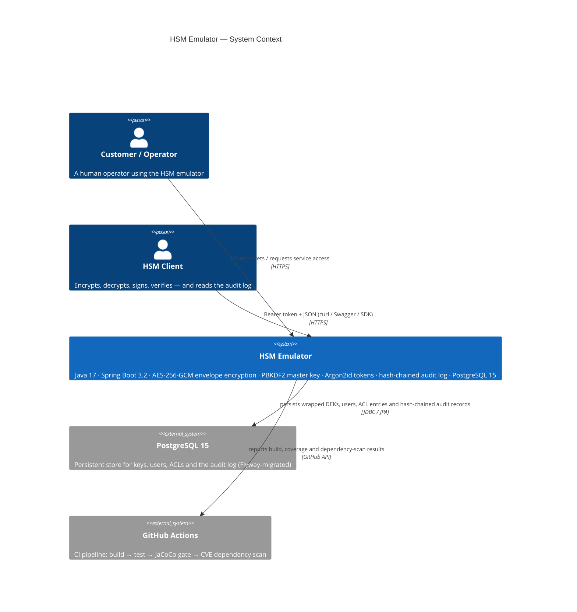

### System architecture (horizontal, stack order)



### Container diagram (deployment units + runtime components)

```mermaid
C4Container
    title HSM Emulator — Container Diagram

    Person(customer, "Customer (operator)", "Admin / CryptoOfficer / AppClient / Auditor")
    Person(app, "HSM Client", "cURL / Swagger UI / SDK")

    System_Boundary(hsm, "HSM Emulator (single Spring Boot 3 JVM)") {
        Container(app, "Spring Boot 3.2 App", "Java 17",
            "REST controllers, @PreAuthorize RBAC, JWT-less Bearer token auth (Argon2id), envelope-encryption crypto services, hash-chained audit service, Flyway migrations")
        Container db, "PostgreSQL 15", "PostgreSQL",
            "hsm_keys (wrapped DEK, IV, auth tag) · hsm_users (Argon2id token hash + role + ACL) · hsm_key_acls · hsm_audit_log (hash chain) · hsm_config (master key salt)")
        Container(lb, "HTTPS Terminator", "nginx / Traefik",
            "Terminates TLS, forwards to the app on :8080, rate-limits and rejects malformed requests at the edge")
    }

    Boundary(securityBoundary, "🔒 Security boundary", "red", [
        Container(app, "Spring Boot 3.2 App", "Java 17", ""),
        Container(db, "PostgreSQL 15", "PostgreSQL", "")
    ])

    Rel(customer, app, "curl / Swagger UI / SDK", "HTTPS + Bearer token")
    Rel(app, db, "JDBC / Spring Data JPA + Flyway", "local network")
    Rel(lb, app, "HTTP/1.1 → :8080", "local network")
```

### Key security properties visible across the stack

| Property | Where it is enforced | Mechanism |
|----------|---------------------|-----------|
| **Envelope encryption** | `CryptoEngine` + `MasterKeyService` | AES-256-GCM wrapping of every DEK; master key PBKDF2-derived from the passphrase, in-process only, never persisted |
| **Authentication oracle** | `TokenAuthenticationFilter` | 401 identical for unknown user, expired token, and malformed token — no oracle leakage |
| **Token storage** | `hsm_users` + `TokenService` | Argon2id hash (BC); only the hash is written to PostgreSQL |
| **Key material at rest** | `hsm_keys` | Raw key bytes never written; stored as `IV +wrapped DEK + auth tag` only |
| **In-memory master key** | `MasterKeyService` | Derived once per startup from `HSM_MASTER_PASSPHRASE`; zeroed on shutdown |
| **Plaintext never in logs/DTOs** | `HsmUser.toString()` / `HsmKey.toString()` / controllers | Secret fields excluded; `SecureArrays#fill` zeroes ephemeral key material after use |
| **Hash-chained audit log** | `AuditService` | `chainHash(N) = SHA256(prev ‖ seq ‖ ts ‖ principal ‖ action ‖ outcome)`; tamper-evident, append-only, single-writer |
| **Separation of duties** | `@PreAuthorize` + ACLs | Admin ≫ `CryptoOfficer ≫ AppClient ≫ Auditor boundary; per-key ACL enforced in `CryptoService` before any unwrap |
| **No custom cryptography** | `CryptoEngine` (JCA only) | 100% `javax.crypto` / `java.security`; Bouncy Castle confined to `Argon2TokenHashingService` |

### Component responsibilities (inside the Spring Boot 3.2 JVM)

| Layer | Responsibility | Key classes |
|-------|----------------|-------------|
| **Edge / security** | Token extraction, Argon2id authentication, 401-oracle, request/response logging | `SecurityConfig`, `TokenAuthenticationFilter`, `HsmPrincipal` |
| **REST controllers** | HTTP mapping, `@Valid` input validation, DTO serialisation, exception → status mapping | `UserController`, `KeyController`, `CryptoController`, `AuditController` |
| **Service layer** | Business logic + RBAC (secondary `@PreAuthorize` check) + per-key ACL enforcement + orchestration + audit append | `UserService`, `KeyService`, `CryptoService`, `AuditService` |
| **Crypto engine** | Stateless JCA wrapper; never returns raw key bytes up the stack | `CryptoEngine`, `MasterKeyService`, `CryptoEngine*` helpers |
| **Persistence** | Spring Data JPA + Flyway migrations; no raw key material in entities | `HsmUser`, `HsmKey`, `HsmKeyAcl`, `AuditRecord`, `HsmConfig` |
| **Observability** | Structured log markers, metrics hooks, audit-read endpoint, chain-verification endpoint | `AuditController`, `GlobalExceptionHandler`, JaCoCo reports |
