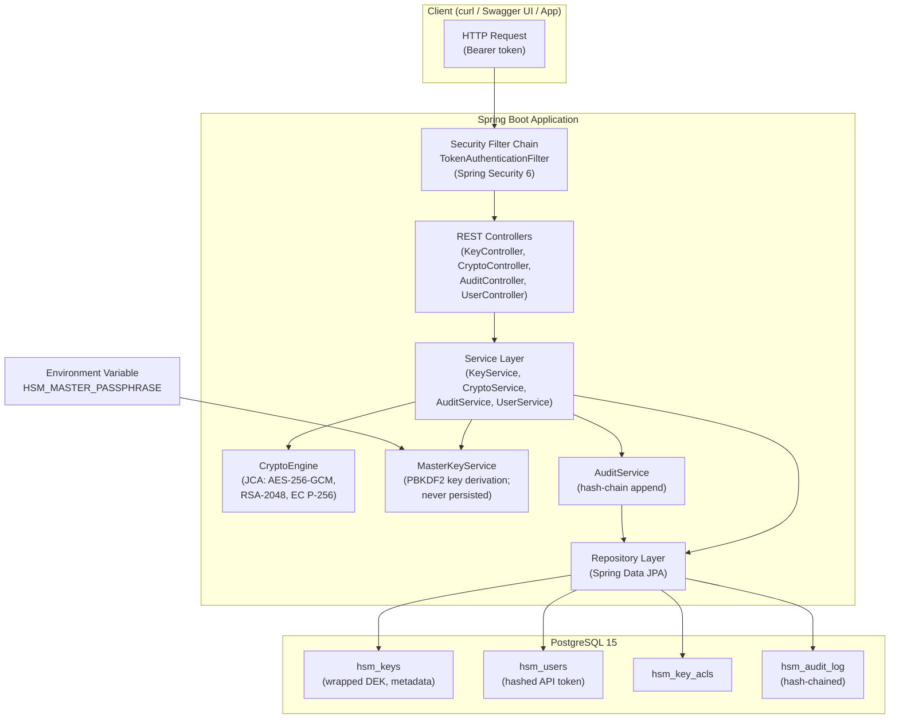
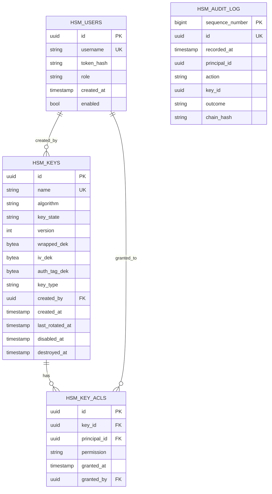
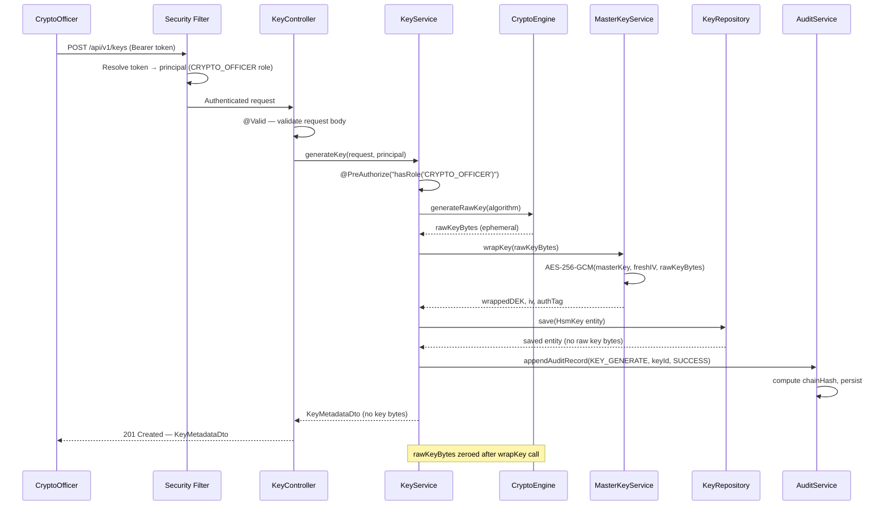
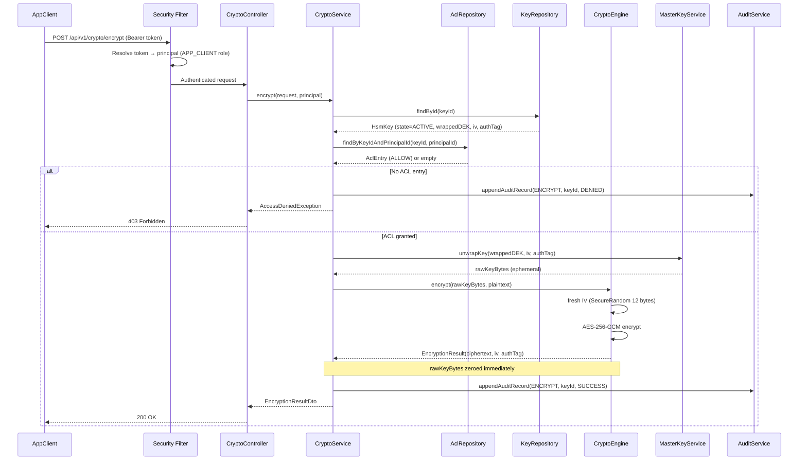
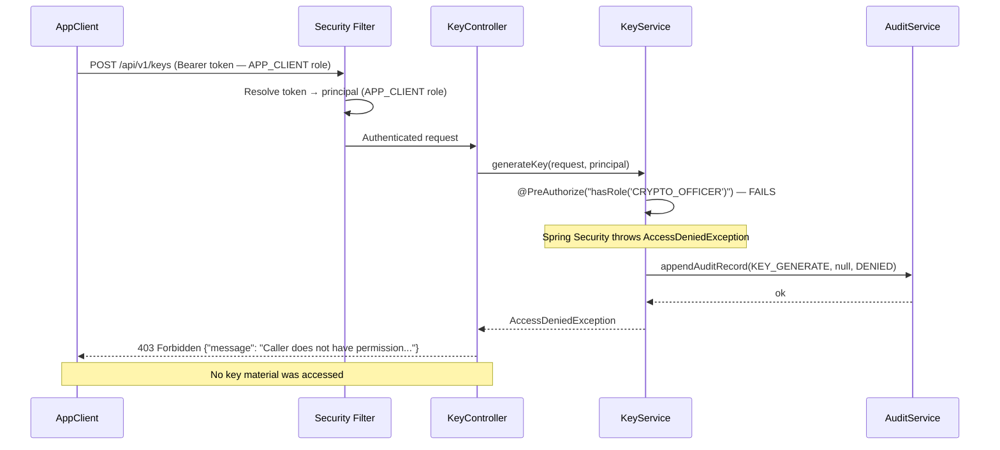
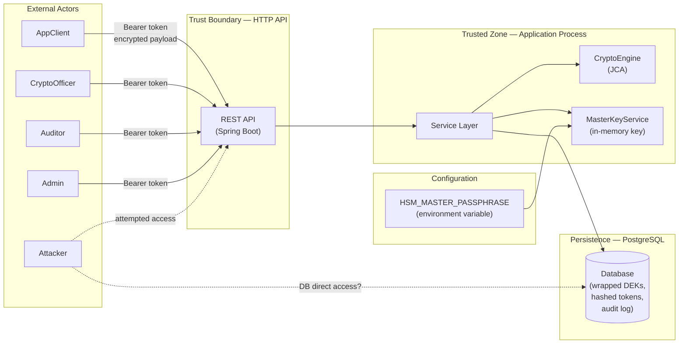

# Design — Software HSM Emulator
> **Disclaimer:** This is an educational software emulator. It does NOT hold FIPS
> 140-2/3 or any other certification and does NOT protect key material with
> tamper-resistant hardware. All security properties described below are
> software-enforced for learning and demonstration purposes only.

---

## Table of Contents
1. [Tech Stack and Justification](#1-tech-stack-and-justification)
2. [Architecture Overview](#2-architecture-overview)
3. [Data Model and Key-Storage Design](#3-data-model-and-key-storage-design)
4. [API Design](#4-api-design)
5. [Sequence Diagrams](#5-sequence-diagrams)
6. [Audit Log Design](#6-audit-log-design)
7. [Error Handling and Failure Modes](#7-error-handling-and-failure-modes)
8. [Threat Model](#8-threat-model)
9. [Testing Strategy](#9-testing-strategy)
10. [Design Decisions and Alternatives](#10-design-decisions-and-alternatives)

---

## 1. Tech Stack and Justification

| Layer | Choice | Justification |
|-------|--------|---------------|
| **Language** | Java 17 (LTS) | Long-term support until 2029. Strong static typing aids security review. `java.security` and `javax.crypto` APIs are the JCA standard — no third-party risk for core crypto. |
| **Framework** | Spring Boot 3.x | Industry-standard; Spring Security provides battle-tested authentication/authorization hooks. Spring Data JPA removes boilerplate DB code while keeping testability. |
| **Build tool** | Maven 3.9 | Ubiquitous in Java enterprise; straightforward plugin ecosystem (Surefire, JaCoCo, OWASP Dependency-Check). Reproducible builds with `<dependencyManagement>`. |
| **Core crypto** | JCA (`javax.crypto`) | Standard library; no additional attack surface. AES-256-GCM, PBKDF2-HmacSHA256, RSA-2048, EC P-256, SHA-256 are all available without third-party jars. Never custom cryptography. |
| **Token hashing** | Bouncy Castle (bcprov-jdk18on) | JCA does not expose Argon2id. Bouncy Castle is the de-facto standard Java security library (used by many JDK vendors internally). Confined to `TokenHashingService` only. |
| **Database** | PostgreSQL 15 | ACID guarantees for key records and audit log. Partial-index and sequence support. Avoids in-memory H2 whose semantics differ from production Postgres. |
| **ORM** | Spring Data JPA / Hibernate 6 | Standard persistence layer; query methods are explicit and reviewable. Named JPQL queries prevent SQL injection. |
| **Auth integration** | Spring Security 6 | `OncePerRequestFilter` for token extraction; `AuthenticationProvider` for token resolution. Well-audited; avoids hand-rolled auth middleware. |
| **API docs** | Springdoc OpenAPI 2 (`springdoc-openapi-starter-webmvc-ui`) | Generates OpenAPI 3.0 spec and Swagger UI automatically from annotations. Zero config for basic use. |
| **Unit/integration tests** | JUnit 5 + Mockito | JUnit 5's `@ExtendWith`, `@Tag`, `@ParameterizedTest` give fine-grained control. Mockito for isolating service layers. |
| **DB in tests** | Testcontainers (PostgreSQL module) | Real Postgres semantics in tests; no H2 dialect surprises. Containers are shared per test suite (not per test) via `@Container` + `DynamicPropertySource`. |
| **Coverage** | JaCoCo Maven plugin | Generates HTML/XML reports; enforced via `<rule>` in `pom.xml` so `mvn verify` fails below threshold. |
| **CI** | GitHub Actions | Free for public repos; native Docker support for Testcontainers; caches Maven `.m2`. |
| **Local runtime** | Docker Compose | Single `docker-compose.yml` spins up Postgres; developers run `mvn spring-boot:run` locally without installing Postgres. |

**Dependency on Bouncy Castle — justification:**
Argon2id (the OWASP-recommended password hashing algorithm as of 2024) is not
available in the JCA standard library. Bouncy Castle is the only widely-reviewed
Java implementation. Its use is strictly limited to `Argon2TokenHashingService`
and is not used for any other cryptographic operation in this project.

---

## 2. Architecture Overview

### Component Diagram



### Layer Responsibilities

| Layer | Responsibility |
|-------|---------------|
| **Security Filter** | Extracts `Bearer` token, resolves principal + roles, populates `SecurityContext`. Rejects missing/invalid tokens with 401 before any controller is reached. |
| **Controllers** | Input validation (`@Valid`), HTTP mapping, response serialisation. No business logic. |
| **Services** | Business logic, RBAC enforcement (secondary check via `@PreAuthorize`), orchestration of crypto + persistence + audit. |
| **CryptoEngine** | Stateless JCA wrapper. All raw key material lives only inside this component during an operation; never returned up the stack as a plain `byte[]` field on a DTO. |
| **MasterKeyService** | Derives and caches the master `SecretKey` from the startup passphrase. Provides `wrapKey(byte[])` and `unwrapKey(byte[])`. Master key is never written anywhere. |
| **AuditService** | Appends audit records with hash-chain maintenance. Single `@Transactional` method so the hash-chain link is always consistent. |
| **Repositories** | Spring Data JPA interfaces; JPQL named queries for any custom finders. No native SQL except where necessary. |

---

## 3. Data Model and Key-Storage Design

### 3.1 Entity Relationship Diagram



### 3.2 Key State Machine

```
  ┌─────────┐  disable   ┌──────────┐  enable   ┌─────────┐
  │ ACTIVE  │───────────▶│ DISABLED │──────────▶│ ACTIVE  │
  └────┬────┘            └────┬─────┘           └─────────┘
       │                      │
       │ destroy              │ destroy
       ▼                      ▼
  ┌───────────┐          ┌───────────┐
  │ DESTROYED │          │ DESTROYED │
  └───────────┘          └───────────┘
        (terminal — wrapped_dek zeroed in DB)
```

### 3.3 Envelope Encryption Design

```
Startup:
  passphrase (env var)
      │
      ▼ PBKDF2-HmacSHA256
      │ (iterations ≥ 310,000, salt stored in hsm_config table)
      ▼
  masterKey (AES-256, in-memory only, never persisted)

Key Generation:
  SecureRandom → rawKeyBytes (32 bytes for AES-256)
      │
      ├─ CryptoEngine uses rawKeyBytes for crypto ops
      │
      ▼ AES-256-GCM(masterKey, freshIV)
      wrappedDEK  ──────────────────────────────▶ DB: hsm_keys.wrapped_dek
                                                       hsm_keys.iv_dek
                                                       hsm_keys.auth_tag_dek

Unwrap (at encrypt/decrypt/sign/verify time):
  DB.wrapped_dek + DB.iv_dek + DB.auth_tag_dek
      │
      ▼ AES-256-GCM decrypt (masterKey)
  rawKeyBytes (ephemeral, in-memory only for duration of operation)
      │
      ▼ crypto op
  result returned to caller
```

**Emulation limit (documented honestly):** In a real HSM, the master key lives inside
tamper-resistant hardware and cannot be extracted even by the host OS. Here, the derived
master key lives in JVM heap memory for the lifetime of the process. An attacker with
OS-level memory access or a heap dump could extract it. This is an accepted limitation
of software emulation.

### 3.4 PBKDF2 Parameters

| Parameter | Value | Rationale |
|-----------|-------|-----------|
| Algorithm | PBKDF2WithHmacSHA256 | Standard JCA; SHA-256 is widely supported |
| Iterations | 310,000 (minimum; configurable upward) | OWASP 2024 recommendation for PBKDF2-HMAC-SHA256 |
| Salt length | 16 bytes (128 bits) | NIST SP 800-132 minimum |
| Output length | 256 bits (32 bytes) | AES-256 key size |
| Salt storage | `hsm_config` table, key = `master_key_salt` | Salt is not secret; storing in DB is acceptable |

---

## 4. API Design

Base path: `/api/v1`  
Authentication: `Authorization: Bearer <token>` on every request.  
Content-Type: `application/json`

### 4.1 User Management (`/users`) — Admin only

| Method | Path | Description |
|--------|------|-------------|
| `POST` | `/users` | Create user, assign role, return one-time token |
| `GET` | `/users` | List all users (no tokens) |
| `DELETE` | `/users/{id}` | Disable user account |
| `POST` | `/users/{id}/roles/{role}` | Assign role |
| `DELETE` | `/users/{id}/roles/{role}` | Revoke role |

**POST /users — Request:**
```json
{
  "username": "app-service-1",
  "role": "APP_CLIENT"
}
```
**POST /users — Response 201:**
```json
{
  "id": "3fa85f64-5717-4562-b3fc-2c963f66afa6",
  "username": "app-service-1",
  "role": "APP_CLIENT",
  "token": "hsm_tk_5Xv3...QmZ1",
  "warning": "This token is shown once and cannot be retrieved again."
}
```

### 4.2 Key Management (`/keys`) — CryptoOfficer only

| Method | Path | Description |
|--------|------|-------------|
| `POST` | `/keys` | Generate a new key |
| `GET` | `/keys` | List all keys (metadata, no key material) |
| `GET` | `/keys/{id}` | Get key metadata |
| `POST` | `/keys/{id}/rotate` | Rotate key (new version) |
| `PATCH` | `/keys/{id}/disable` | Disable key |
| `PATCH` | `/keys/{id}/enable` | Re-enable key |
| `DELETE` | `/keys/{id}` | Destroy key (irreversible) |
| `POST` | `/keys/{id}/acl` | Grant AppClient access |
| `DELETE` | `/keys/{id}/acl/{principalId}` | Revoke AppClient access |

**POST /keys — Request:**
```json
{
  "name": "payment-data-key",
  "algorithm": "AES_256",
  "description": "Encrypts payment card numbers at rest"
}
```
**POST /keys — Response 201:**
```json
{
  "id": "a1b2c3d4-...",
  "name": "payment-data-key",
  "algorithm": "AES_256",
  "keyType": "SYMMETRIC",
  "state": "ACTIVE",
  "version": 1,
  "createdAt": "2026-10-04T17:00:00Z",
  "createdBy": "officer-uuid"
}
```

**DELETE /keys/{id} — Response 200:**
```json
{
  "id": "a1b2c3d4-...",
  "state": "DESTROYED",
  "destroyedAt": "2026-10-04T18:00:00Z",
  "message": "Key material has been zeroed. This action is irreversible."
}
```

### 4.3 Cryptographic Operations (`/crypto`) — AppClient only

| Method | Path | Description |
|--------|------|-------------|
| `POST` | `/crypto/encrypt` | Encrypt plaintext |
| `POST` | `/crypto/decrypt` | Decrypt ciphertext |
| `POST` | `/crypto/sign` | Sign data |
| `POST` | `/crypto/verify` | Verify signature |

**POST /crypto/encrypt — Request:**
```json
{
  "keyId": "a1b2c3d4-...",
  "plaintext": "SGVsbG8gV29ybGQ="
}
```
**POST /crypto/encrypt — Response 200:**
```json
{
  "keyId": "a1b2c3d4-...",
  "keyVersion": 1,
  "algorithm": "AES_256_GCM",
  "iv": "aGVsbG9pdg==",
  "ciphertext": "5Xv3...",
  "authTag": "Qm1..."
}
```

**POST /crypto/decrypt — Request:**
```json
{
  "keyId": "a1b2c3d4-...",
  "iv": "aGVsbG9pdg==",
  "ciphertext": "5Xv3...",
  "authTag": "Qm1..."
}
```
**POST /crypto/decrypt — Response 200:**
```json
{
  "keyId": "a1b2c3d4-...",
  "plaintext": "SGVsbG8gV29ybGQ="
}
```

**POST /crypto/sign — Request:**
```json
{
  "keyId": "ec-key-uuid",
  "data": "dGhlIGRhdGEgdG8gc2lnbg=="
}
```
**POST /crypto/sign — Response 200:**
```json
{
  "keyId": "ec-key-uuid",
  "algorithm": "SHA256withECDSA",
  "signature": "MEUCIQD..."
}
```

**POST /crypto/verify — Request:**
```json
{
  "keyId": "ec-key-uuid",
  "data": "dGhlIGRhdGEgdG8gc2lnbg==",
  "signature": "MEUCIQD..."
}
```
**POST /crypto/verify — Response 200:**
```json
{
  "keyId": "ec-key-uuid",
  "valid": true
}
```

### 4.4 Audit Log (`/audit`) — Auditor only

| Method | Path | Description |
|--------|------|-------------|
| `GET` | `/audit` | Paginated audit records with optional filters |
| `GET` | `/audit/verify` | Verify hash-chain integrity |

**GET /audit?page=0&size=20&from=2026-01-01T00:00:00Z&to=2026-12-31T23:59:59Z**
```json
{
  "page": 0,
  "size": 20,
  "totalElements": 142,
  "records": [
    {
      "sequenceNumber": 1,
      "id": "uuid",
      "recordedAt": "2026-10-04T17:00:00.123456789Z",
      "principalId": "uuid",
      "action": "KEY_GENERATE",
      "keyId": "a1b2c3d4-...",
      "outcome": "SUCCESS",
      "chainHash": "3a7bd3e2..."
    }
  ]
}
```

**GET /audit/verify — Response 200 (intact):**
```json
{
  "valid": true,
  "recordCount": 142,
  "verifiedAt": "2026-10-04T18:00:00Z"
}
```

**GET /audit/verify — Response 200 (tampered):**
```json
{
  "valid": false,
  "recordCount": 142,
  "firstTamperedSequence": 17,
  "verifiedAt": "2026-10-04T18:00:00Z"
}
```

### 4.5 Standard Error Response Shape

All errors use a consistent envelope:
```json
{
  "timestamp": "2026-10-04T18:00:00Z",
  "status": 403,
  "error": "Forbidden",
  "message": "Caller does not have permission to perform this operation.",
  "path": "/api/v1/crypto/encrypt"
}
```

---

## 5. Sequence Diagrams

### 5.1 Key Generation



### 5.2 Encrypt Operation



### 5.3 RBAC-Denied Request



---

## 6. Audit Log Design

### 6.1 Hash Chain Construction

Each audit record's `chain_hash` commits to its own content and the hash of the
previous record, forming an append-only, tamper-evident chain:

```
Record N:
  chainHash(N) = SHA-256(
      chainHash(N-1)          -- previous hash (hex string)
    ∥ sequenceNumber(N)       -- as string
    ∥ recordedAt(N)           -- ISO-8601 with nanoseconds
    ∥ principalId(N)          -- UUID string, or "SYSTEM"
    ∥ action(N)               -- e.g. "KEY_GENERATE"
    ∥ keyId(N)                -- UUID string, or "null"
    ∥ outcome(N)              -- "SUCCESS", "DENIED", "ERROR"
  )

Record 1 (genesis):
  chainHash(0) = "0000000000000000000000000000000000000000000000000000000000000000"
```

All fields are concatenated with `|` as delimiter before hashing to avoid
length-extension collisions between fields.

### 6.2 Integrity Verification Algorithm

```
1. Load all records ordered by sequence_number ASC.
2. previousHash ← "000...0" (64 zeros)
3. For each record R:
     expected = SHA-256(previousHash | R.sequenceNumber | R.recordedAt |
                        R.principalId | R.action | R.keyId | R.outcome)
     if expected ≠ R.chainHash:
         return { valid: false, firstTamperedSequence: R.sequenceNumber }
     previousHash ← R.chainHash
4. return { valid: true, recordCount: N }
```

### 6.3 Audit Actions Catalogue

| Action Constant | Trigger |
|-----------------|---------|
| `USER_CREATE` | New user created |
| `USER_DISABLE` | User account disabled |
| `ROLE_ASSIGN` | Role granted to user |
| `ROLE_REVOKE` | Role revoked from user |
| `KEY_GENERATE` | Key generated |
| `KEY_ROTATE` | Key rotated |
| `KEY_DISABLE` | Key disabled |
| `KEY_ENABLE` | Key re-enabled |
| `KEY_DESTROY` | Key destroyed |
| `ACL_GRANT` | ACL entry created |
| `ACL_REVOKE` | ACL entry removed |
| `ENCRYPT` | Encrypt operation |
| `DECRYPT` | Decrypt operation |
| `SIGN` | Sign operation |
| `VERIFY` | Verify operation |
| `AUDIT_READ` | Audit log read |
| `AUDIT_VERIFY` | Audit log integrity check |

### 6.4 Transactional Guarantee

The audit record is written in the **same transaction** as the primary operation
(key save, ACL change, etc.). For DENIED/ERROR outcomes, the audit record is written
in its own transaction so the denial is always persisted even when the primary
operation's transaction rolls back.

```java
// Pseudocode — service layer pattern
@Transactional
public KeyMetadataDto generateKey(...) {
    // ... generate and persist key ...
    auditService.appendInCurrentTransaction(ACTION, keyId, SUCCESS);
    return dto;
}
// On exception, a separate @Transactional(REQUIRES_NEW) records DENIED/ERROR
```

---

## 7. Error Handling and Failure Modes

### 7.1 Exception Hierarchy

```
HsmException (base, unchecked)
├── AuthenticationException          → HTTP 401
├── AccessDeniedException            → HTTP 403
├── KeyNotFoundException             → HTTP 404
├── KeyAlreadyExistsException        → HTTP 409
├── InvalidKeyStateException         → HTTP 422  (e.g. DISABLED/DESTROYED)
├── CryptographicOperationException  → HTTP 400  (e.g. GCM tag fail)
└── HsmInternalException             → HTTP 500  (unexpected; no detail exposed)
```

A `@ControllerAdvice` global exception handler maps every exception type to the
standard error envelope. Stack traces are **never** serialised into responses.

### 7.2 Failure Modes

| Failure Mode | Behaviour |
|-------------|-----------|
| Missing/invalid Bearer token | 401 — generic message, no distinction between bad token and unknown user |
| Role mismatch | 403 — audit record written (DENIED) |
| Key not found | 404 — no distinction between "never existed" and "destroyed" to prevent oracle attacks |
| Key in DISABLED state | 422 — operation rejected; audit record written |
| Key in DESTROYED state | 410 Gone — operation rejected |
| GCM auth tag failure | 400 — message says "decryption failed"; does not say which part failed |
| DB connection lost | 503 Service Unavailable — circuit breaker not in scope; Spring's default transactional rollback applies |
| Master key derivation fails at startup | Application fails to start (fail-fast); no partial startup |
| Passphrase env var missing at startup | Application fails to start with a clear log message (not the passphrase value) |
| Audit log write fails | Transaction rolls back; operation is not committed without an audit record (integrity guarantee) |

---

## 8. Threat Model

### 8.1 Data Flow Diagram



### 8.2 Assets

| Asset | Sensitivity | Location |
|-------|------------|----------|
| Raw key material (DEKs) | Critical | JVM heap only; never persisted in plaintext |
| Master key | Critical | JVM heap only; derived at startup |
| Master passphrase | Critical | Environment variable; never logged |
| Wrapped DEKs | High | PostgreSQL `hsm_keys` table |
| API tokens (hashed) | High | PostgreSQL `hsm_users` table |
| Audit log | High | PostgreSQL `hsm_audit_log` table |
| Key metadata | Medium | PostgreSQL `hsm_keys` table |

### 8.3 Trust Boundaries

1. **HTTP boundary:** All external principals (including legitimate users) are untrusted
   until their token is verified.
2. **DB boundary:** The database is considered a semi-trusted store; it holds only
   wrapped (encrypted) key material and hashed tokens. A DB read alone does not
   compromise key material (requires master key too).
3. **JVM process boundary:** The application process is trusted. An attacker with
   OS-level access to the JVM heap can extract the in-memory master key — this is
   the primary residual risk of software emulation.
4. **Environment boundary:** The passphrase env var is trusted as configured by the
   operator.

### 8.4 STRIDE Threat Table

| ID | Category | Threat | Asset | Impact | Mitigation | Verifying Test |
|----|----------|--------|-------|--------|------------|----------------|
| T1 | **S**poofing | Attacker forges API token to impersonate a CryptoOfficer | Bearer tokens | Unauthorised key generation/destruction | Argon2id hashing with high cost; constant-time comparison; 401 on any failure | `AuthenticationServiceTest#falseTokenIsRejected` |
| T2 | **T**ampering | Attacker modifies a row in `hsm_audit_log` | Audit log | Undetected security event | SHA-256 hash chain; `GET /audit/verify` exposes breaks | `AuditIntegrityTest#tamperedRecordIsDetected` |
| T3 | **T**ampering | Attacker modifies `wrapped_dek` in `hsm_keys` | Wrapped key | Decryption failure / data loss (not key exposure due to GCM auth) | AES-256-GCM authentication tag covers wrapped DEK; unwrap fails with `BadPaddingException` → 400 | `CryptoEngineTest#tamperedWrappedDekIsRejected` |
| T4 | **R**epudiation | Actor denies performing a key destruction | Audit log | Inability to attribute destructive action | Every operation writes an audit record in the same transaction; records are hash-chained | `AuditServiceTest#destructionIsAudited` |
| T5 | **I**nformation Disclosure | Error response reveals whether the key exists | Key existence | Attacker enumerates valid key IDs | 404 for both missing and destroyed; no distinguishing message | `KeyControllerTest#destroyedKeyReturns404NotGone` — **Note:** currently design uses 410; reconsider uniformity. Interim: 404 for unknown, 410 for destroyed, no message distinguishing destroy reason. |
| T6 | **I**nformation Disclosure | Key material appears in a log line | Raw DEK | Key compromise | No `toString()` on key byte arrays; no logging of `byte[]` fields; SLF4J MDC never includes key bytes | `KeyLoggingTest#rawKeyBytesNeverLogged` |
| T7 | **I**nformation Disclosure | Heap dump exposes master key | Master key | All stored keys compromised | Accepted residual risk of software emulation; documented in README; zeroing `byte[]` after use reduces window | Design limitation — document and accept |
| T8 | **D**enial of Service | Attacker floods `/crypto/encrypt` to exhaust CPU | Service availability | Legitimate users cannot use the service | Rate limiting not in v1 scope; document as known limitation; Spring Boot Actuator metrics for detection | Out of scope — document |
| T9 | **E**levation of Privilege | AppClient calls key lifecycle endpoint | RBAC | Unauthorised key rotation/destruction | `@PreAuthorize` on every service method; security filter rejects wrong role before controller; audit record on denial | `RbacEnforcementTest#appClientCannotGenerateKey` |
| T10 | **E**levation of Privilege | AppClient uses a key it was not granted | Per-key ACL | Unauthorised encryption of sensitive data | ACL checked in `CryptoService` before key is unwrapped | `AclEnforcementTest#appClientWithoutAclIsRejected` |

### 8.5 Residual Risks

| Risk | Notes |
|------|-------|
| In-memory master key extractable from heap dump | Inherent to software emulation. A real HSM stores keys in tamper-resistant hardware. Document in README. Mitigated partially by zeroing byte arrays after use. |
| GCM IV reuse at high volume | Using `SecureRandom` means IV collision probability is negligible for typical workloads, but non-zero at very high volumes. Documented. Key rotation is the operational mitigation. |
| Passphrase in environment variable | Standard 12-factor pattern; acceptable risk. Operators should use a secrets manager to inject it (e.g., AWS Secrets Manager → env var at container start). |
| No rate limiting on authentication endpoint | Brute-force of API tokens is computationally infeasible with Argon2id, but the endpoint is still unbounded. Document as v2 improvement. |

---

## 9. Testing Strategy

### 9.1 Test Layers

```
┌─────────────────────────────────────────────────────┐
│  Integration Tests (@SpringBootTest + Testcontainers) │
│  - Full HTTP stack                                    │
│  - Real PostgreSQL (Testcontainers)                   │
│  - Cover happy paths and cross-layer RBAC             │
├─────────────────────────────────────────────────────┤
│  Service/Unit Tests (JUnit 5 + Mockito)               │
│  - Business logic in isolation                        │
│  - Repository mocked                                  │
│  - All RBAC guard paths (denied cases)                │
├─────────────────────────────────────────────────────┤
│  Crypto Unit Tests (JUnit 5, no mocks)                │
│  - CryptoEngine: encrypt→decrypt round-trip           │
│  - CryptoEngine: tampered ciphertext → exception      │
│  - MasterKeyService: PBKDF2 determinism with same salt│
│  - AuditService: hash chain construction              │
├─────────────────────────────────────────────────────┤
│  Security / Negative Tests (@Tag("security"))         │
│  - Every RBAC boundary (all 4 roles × all endpoints)  │
│  - Key state guards (DISABLED, DESTROYED)             │
│  - ACL denial                                         │
│  - Tampered audit log detection                       │
│  - Missing token → 401                                │
│  - Invalid token → 401                                │
└─────────────────────────────────────────────────────┘
```

### 9.2 Testcontainers Setup

```java
// Shared container — one Postgres instance per test suite JVM run
@Testcontainers
class AbstractIntegrationTest {

    @Container
    static PostgreSQLContainer<?> postgres =
        new PostgreSQLContainer<>("postgres:15-alpine")
            .withDatabaseName("hsm_test")
            .withUsername("hsm")
            .withPassword("hsm");

    @DynamicPropertySource
    static void registerProperties(DynamicPropertyRegistry r) {
        r.add("spring.datasource.url", postgres::getJdbcUrl);
        r.add("spring.datasource.username", postgres::getUsername);
        r.add("spring.datasource.password", postgres::getPassword);
    }
}
```

### 9.3 Coverage Enforcement (JaCoCo)

```xml
<!-- pom.xml excerpt -->
<plugin>
  <groupId>org.jacoco</groupId>
  <artifactId>jacoco-maven-plugin</artifactId>
  <executions>
    <execution>
      <id>check</id>
      <goals><goal>check</goal></goals>
      <configuration>
        <rules>
          <rule>
            <element>BUNDLE</element>
            <limits>
              <limit>
                <counter>LINE</counter>
                <value>COVEREDRATIO</value>
                <minimum>0.80</minimum>
              </limit>
              <limit>
                <counter>BRANCH</counter>
                <value>COVEREDRATIO</value>
                <minimum>0.75</minimum>
              </limit>
            </limits>
          </rule>
        </rules>
      </configuration>
    </execution>
  </executions>
</plugin>
```

### 9.4 GitHub Actions CI Pipeline

```yaml
# .github/workflows/ci.yml (outline)
name: CI
on: [push, pull_request]
jobs:
  build:
    runs-on: ubuntu-latest
    services:
      # Testcontainers starts its own Postgres — no service block needed
    steps:
      - uses: actions/checkout@v4
      - uses: actions/setup-java@v4
        with: { java-version: '17', distribution: 'temurin' }
      - uses: actions/cache@v4
        with: { path: ~/.m2, key: "${{ hashFiles('**/pom.xml') }}" }
      - run: mvn --batch-mode verify        # build + test + JaCoCo gate
      - uses: actions/upload-artifact@v4
        with:
          name: jacoco-report
          path: target/site/jacoco/
      - run: mvn --batch-mode dependency:check   # OWASP CVE scan
```

---

## 10. Design Decisions and Alternatives

### DD-01 — AES-256-GCM for envelope encryption
**Chosen:** AES-256-GCM for both DEK wrapping and symmetric crypto operations.  
**Alternative considered:** AES-256-CBC + HMAC-SHA256 (Encrypt-then-MAC).  
**Reason rejected:** GCM provides authenticated encryption in a single pass; CBC
requires separate MAC computation and careful IV/padding handling. GCM is the current
NIST recommended mode. Risk: GCM nonce reuse; mitigated by `SecureRandom` IV per
operation and key rotation policy.

### DD-02 — PBKDF2 for master key derivation (not Argon2)
**Chosen:** PBKDF2-HmacSHA256 for the startup passphrase.  
**Alternative considered:** Argon2id (memory-hard, more resistant to GPU cracking).  
**Reason:** The master key derivation happens once at startup, not on every request.
The passphrase is expected to be a long random string managed by an operator or
secrets manager — not a human-typed password. PBKDF2 is available in the JCA standard
library (no third-party dependency for this path), which reduces supply-chain risk
for the highest-privilege operation. Argon2id's memory-hardness advantage is most
significant for human-chosen passwords. **Bouncy Castle is still pulled in** for
API token hashing (Argon2id), where human-chosen or short tokens benefit from
memory-hard hashing.

### DD-03 — Argon2id for API token hashing (not bcrypt/scrypt)
**Chosen:** Argon2id via Bouncy Castle for hashing API tokens.  
**Alternatives:** bcrypt (`spring-security-crypto`), scrypt.  
**Reason:** Argon2id is the PHC winner and OWASP 2024 first recommendation. It is
resistant to both GPU and ASIC cracking. Bouncy Castle is an acceptable single
dependency for this; its scope is limited to `TokenHashingService`.

### DD-04 — PostgreSQL over H2
**Chosen:** PostgreSQL 15 (Testcontainers in tests, Docker Compose locally).  
**Alternative:** H2 in-memory with Postgres compatibility mode.  
**Reason:** H2's Postgres compatibility mode is incomplete. Using real Postgres in
tests means the same SQL dialect, index behaviour, and constraint semantics in CI and
production. Testcontainers makes this straightforward with no local Postgres install
required.

### DD-05 — Hash-chained audit log over a separate signing service
**Chosen:** SHA-256 hash chain computed in-process, stored alongside records.  
**Alternative:** HMAC-signed records using a separate audit signing key; or
a Merkle tree.  
**Reason:** An HMAC approach requires managing a second secret key. A Merkle tree is
more complex to implement and verify. A hash chain is well-understood, easy to verify
with a simple linear scan, and meets the tamper-evidence requirement for this
educational project. Limitation: a DB admin who can modify both the record and its
hash can silently forge a consistent chain. This is documented honestly.

### DD-06 — Spring Security `@PreAuthorize` over a custom interceptor
**Chosen:** `@PreAuthorize("hasRole('...')")` on service methods.  
**Alternative:** A custom `HandlerInterceptor` checking roles before dispatching.  
**Reason:** `@PreAuthorize` integrates with Spring Security's `SecurityContext`,
is well-tested, and is the standard Spring idiom. It is method-level (cannot be
bypassed by adding a new controller method that calls the service directly without
going through the interceptor chain).

### DD-07 — No key export API
**Chosen:** Keys cannot be exported from the system.  
**Alternative:** PKCS#8 / PKCS#12 export with wrapping.  
**Reason:** Key export is one of the highest-risk operations in HSM design. Excluding
it eliminates a large attack surface and keeps the implementation scope achievable in
two weeks. Documented as a known limitation / v2 feature.
